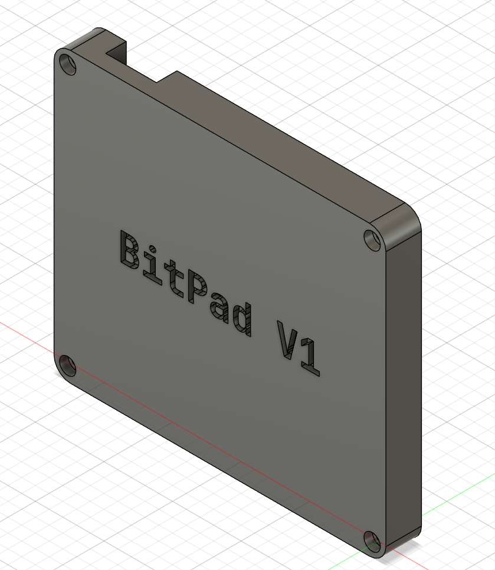
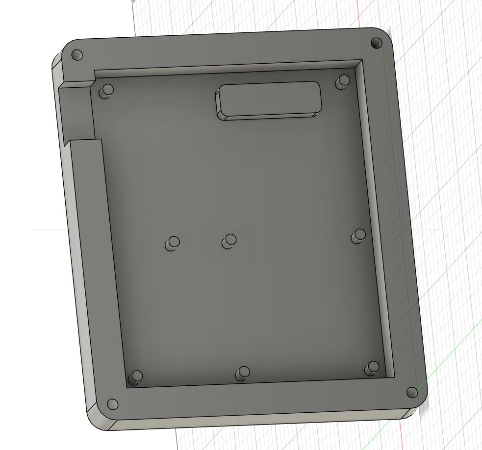
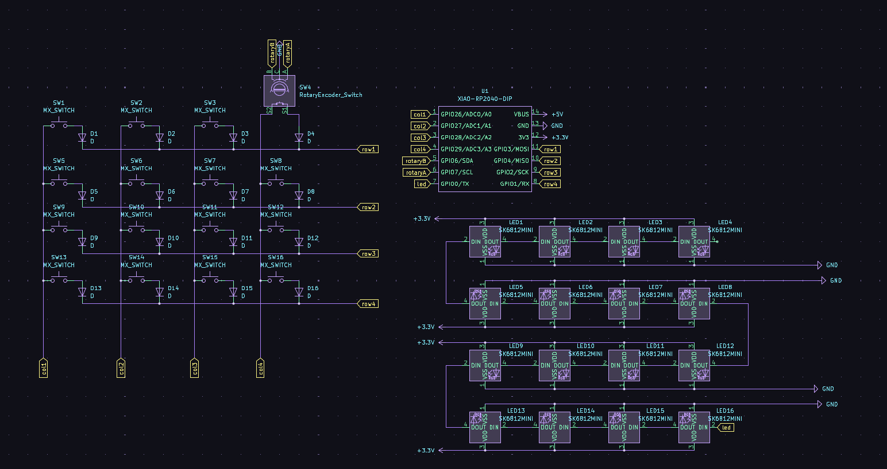
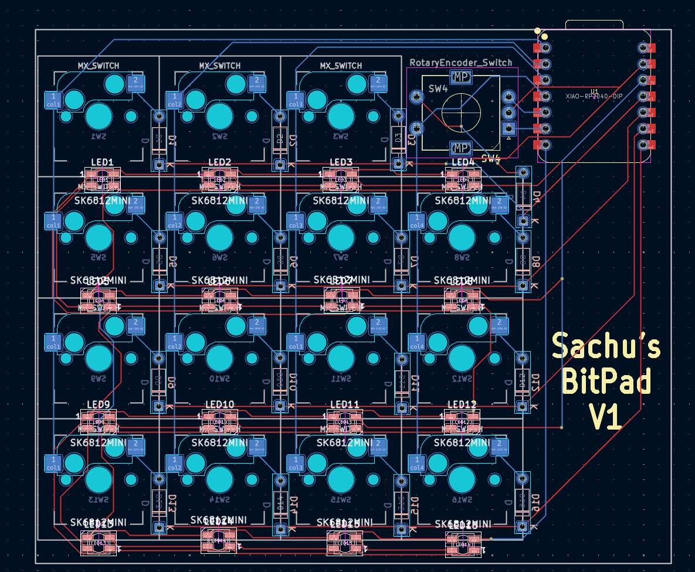

# BitPad

A simple, customizable macropad with fully programmable keys, per-key RGB
lighting, multiple profiles for gaming, programming, editing, and more. uses QMK
Firmware

## CAD

## PCB

 

## Firmware

Firmware available at [firmware/](firmware/) firmware will be updated soon.

## BOM (Bill of materials)

Here's what I used for the device:

- 1x XIAO_RP2040 module
- 1x SK6812 Mini LEDs
- 1x EC11 Rotary Encoder
- 4x M3x16mm screws
- 4x M3x5mmx4mm inserts
- 16x Cherry MX Hotswappable Switches
- 16x DSA Keycaps
- 3D Printed Case
